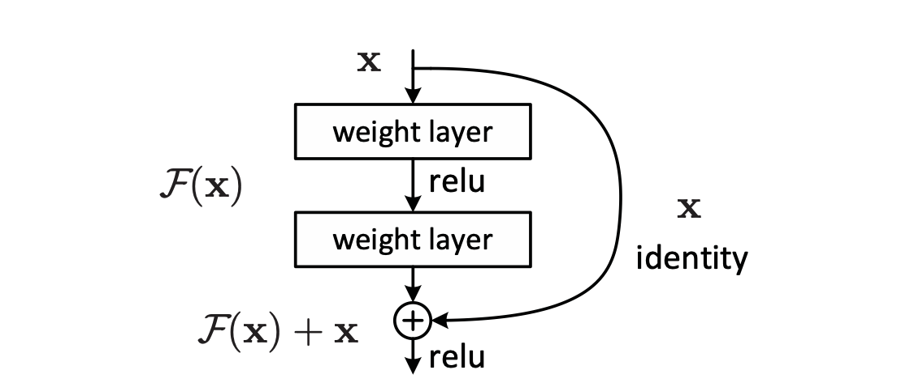
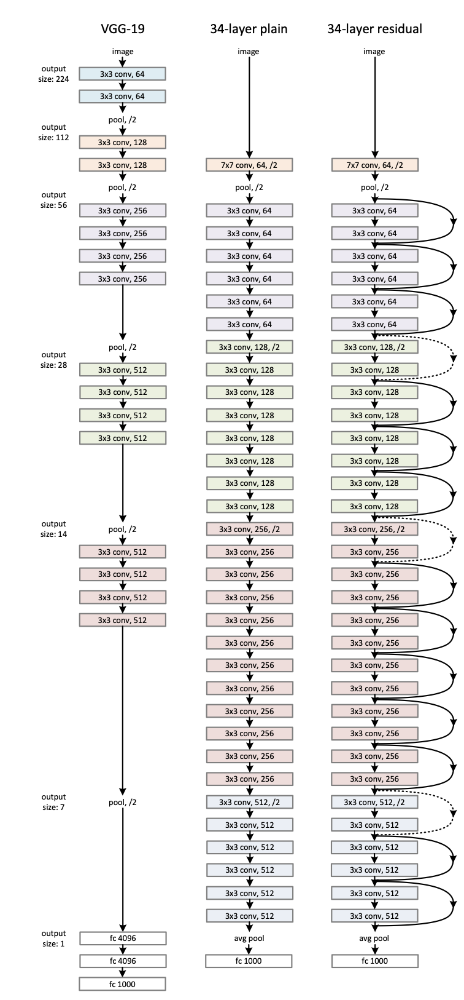

# ResNet on CIFAR-10

<hr>

## Contents

1. [Highlights](#Highlights)
2. [ResNet Primer](#ResNet)
3. [Requirements](#Requirements)
4. [Supervised Training](#Training)
5. [Results](#Results)


<hr>

## Highlights
This project is a implementation from scratch of a slightly modified version of the vanilla ResNet introduced in the paper [Deep Residual Learning for Image Recognition](https://arxiv.org/abs/1512.03385). We implement this model on the small scale benchmark dataset `CIFAR-10`. One of the goals of this project is to illustrate the speed gain of the ResNet model in comparison to the vision transformer models while maintaining comparable accuracy on `CIFAR-10` and other small-scale datasets. 

For an extremely fast ResNet model on `CIFAR-10`, check out David Page's amazing blog post [How to Train Your ResNet 8: Bag of Tricks](https://myrtle.ai/learn/how-to-train-your-resnet-8-bag-of-tricks/), where a modified ResNet is trained to reach 94% accuracy in 26 seconds on a V100 GPU.

<hr>

## ResNet Primer
ResNet, short for Residual Network is a specific type of neural network that was introduced in 2015 by Kaiming He, Xiangyu Zhang, Shaoqing Ren and Jian Sun in their paper “Deep Residual Learning for Image Recognition”. The ResNet models were extremely successful which you can see from the following results:
* Won 1st place in the ILSVRC 2015 classification competition with a top-5 error rate of
      3.57% (An ensemble model).
* Won the 1st place in ILSVRC and COCO 2015 competition in ImageNet Detection,
      ImageNet localization, Coco detection and Coco segmentation.  
* Replacing VGG-16 layers in Faster R-CNN with ResNet-101. They observed relative
      improvements of 28%.
* Efficiently trained networks with 100 layers and 1000 layers also.  

In order to solve complex problems, we stack some additional layers in the Deep Neural Networks which results in improved accuracy and performance. The intuition behind adding more layers is that these layers progressively learn more complex features. For example, in case of classifying images, the first layer may learn to detect edges, the second layer may learn to identify textures and similarly the third layer can learn to detect objects and so on. But it has been found that there is a maximum threshold for depth with the traditional Convolutional neural network model as a result of the vanishing gradient problem.

 How can we build deeper networks? Enter the residual block:

</img>

The main component of the residual block is the skip connection.  Skip connections in ResNet architectures provide a direct link between earlier and later layers, facilitating information preservation and ease of training in deep networks. They enable the network to learn residual mappings rather than full transformations, addressing the vanishing gradient problem. This technique allows for the construction of much deeper neural networks without performance degradation.

A typical ResNet architecture looks like the following:

</img>

Our specific implementation is given here:
```
ResNet(
  (0): Stem(
    (0): ConvBlock(
      (0): Conv2d(3, 32, kernel_size=(3, 3), stride=(1, 1), padding=(1, 1), bias=False)
      (1): BatchNorm2d(32, eps=1e-05, momentum=0.1, affine=True, track_running_stats=True)
      (2): SiLU(inplace=True)
    )
    (1): ConvBlock(
      (0): Conv2d(32, 32, kernel_size=(3, 3), stride=(1, 1), padding=(1, 1), bias=False)
      (1): BatchNorm2d(32, eps=1e-05, momentum=0.1, affine=True, track_running_stats=True)
      (2): SiLU(inplace=True)
    )
    (2): ConvBlock(
      (0): Conv2d(32, 64, kernel_size=(3, 3), stride=(1, 1), padding=(1, 1), bias=False)
      (1): BatchNorm2d(64, eps=1e-05, momentum=0.1, affine=True, track_running_stats=True)
      (2): SiLU(inplace=True)
    )
  )
  (1): ResidualStack(
    (0): ResidualBlock(
      (shortcut): Identity()
      (residual): BasicResidual(
        (0): ConvBlock(
          (0): Conv2d(64, 64, kernel_size=(3, 3), stride=(1, 1), padding=(1, 1), bias=False)
          (1): BatchNorm2d(64, eps=1e-05, momentum=0.1, affine=True, track_running_stats=True)
          (2): SiLU(inplace=True)
        )
        (1): ConvBlock(
          (0): Conv2d(64, 64, kernel_size=(3, 3), stride=(1, 1), padding=(1, 1), bias=False)
          (1): BatchNorm2d(64, eps=1e-05, momentum=0.1, affine=True, track_running_stats=True)
        )
        (2): Dropout2d(p=0.0, inplace=False)
      )
      (act): SiLU(inplace=True)
    )
    (1): ResidualBlock(
      (shortcut): Identity()
      (residual): BasicResidual(
        (0): ConvBlock(
          (0): Conv2d(64, 64, kernel_size=(3, 3), stride=(1, 1), padding=(1, 1), bias=False)
          (1): BatchNorm2d(64, eps=1e-05, momentum=0.1, affine=True, track_running_stats=True)
          (2): SiLU(inplace=True)
        )
        (1): ConvBlock(
          (0): Conv2d(64, 64, kernel_size=(3, 3), stride=(1, 1), padding=(1, 1), bias=False)
          (1): BatchNorm2d(64, eps=1e-05, momentum=0.1, affine=True, track_running_stats=True)
        )
        (2): Dropout2d(p=0.0, inplace=False)
      )
      (act): SiLU(inplace=True)
    )
    (2): MaxPool2d(kernel_size=2, stride=2, padding=0, dilation=1, ceil_mode=False)
    (3): ResidualBlock(
      (shortcut): ConvBlock(
        (0): Conv2d(64, 128, kernel_size=(1, 1), stride=(1, 1), bias=False)
        (1): BatchNorm2d(128, eps=1e-05, momentum=0.1, affine=True, track_running_stats=True)
      )
      (residual): BasicResidual(
        (0): ConvBlock(
          (0): Conv2d(64, 128, kernel_size=(3, 3), stride=(1, 1), padding=(1, 1), bias=False)
          (1): BatchNorm2d(128, eps=1e-05, momentum=0.1, affine=True, track_running_stats=True)
          (2): SiLU(inplace=True)
        )
        (1): ConvBlock(
          (0): Conv2d(128, 128, kernel_size=(3, 3), stride=(1, 1), padding=(1, 1), bias=False)
          (1): BatchNorm2d(128, eps=1e-05, momentum=0.1, affine=True, track_running_stats=True)
        )
        (2): Dropout2d(p=0.0, inplace=False)
      )
      (act): SiLU(inplace=True)
    )
    (4): ResidualBlock(
      (shortcut): Identity()
      (residual): BasicResidual(
        (0): ConvBlock(
          (0): Conv2d(128, 128, kernel_size=(3, 3), stride=(1, 1), padding=(1, 1), bias=False)
          (1): BatchNorm2d(128, eps=1e-05, momentum=0.1, affine=True, track_running_stats=True)
          (2): SiLU(inplace=True)
        )
        (1): ConvBlock(
          (0): Conv2d(128, 128, kernel_size=(3, 3), stride=(1, 1), padding=(1, 1), bias=False)
          (1): BatchNorm2d(128, eps=1e-05, momentum=0.1, affine=True, track_running_stats=True)
        )
        (2): Dropout2d(p=0.0, inplace=False)
      )
      (act): SiLU(inplace=True)
    )
    (5): MaxPool2d(kernel_size=2, stride=2, padding=0, dilation=1, ceil_mode=False)
    (6): ResidualBlock(
      (shortcut): ConvBlock(
        (0): Conv2d(128, 256, kernel_size=(1, 1), stride=(1, 1), bias=False)
        (1): BatchNorm2d(256, eps=1e-05, momentum=0.1, affine=True, track_running_stats=True)
      )
      (residual): BasicResidual(
        (0): ConvBlock(
          (0): Conv2d(128, 256, kernel_size=(3, 3), stride=(1, 1), padding=(1, 1), bias=False)
          (1): BatchNorm2d(256, eps=1e-05, momentum=0.1, affine=True, track_running_stats=True)
          (2): SiLU(inplace=True)
        )
        (1): ConvBlock(
          (0): Conv2d(256, 256, kernel_size=(3, 3), stride=(1, 1), padding=(1, 1), bias=False)
          (1): BatchNorm2d(256, eps=1e-05, momentum=0.1, affine=True, track_running_stats=True)
        )
        (2): Dropout2d(p=0.0, inplace=False)
      )
      (act): SiLU(inplace=True)
    )
    (7): ResidualBlock(
      (shortcut): Identity()
      (residual): BasicResidual(
        (0): ConvBlock(
          (0): Conv2d(256, 256, kernel_size=(3, 3), stride=(1, 1), padding=(1, 1), bias=False)
          (1): BatchNorm2d(256, eps=1e-05, momentum=0.1, affine=True, track_running_stats=True)
          (2): SiLU(inplace=True)
        )
        (1): ConvBlock(
          (0): Conv2d(256, 256, kernel_size=(3, 3), stride=(1, 1), padding=(1, 1), bias=False)
          (1): BatchNorm2d(256, eps=1e-05, momentum=0.1, affine=True, track_running_stats=True)
        )
        (2): Dropout2d(p=0.0, inplace=False)
      )
      (act): SiLU(inplace=True)
    )
    (8): MaxPool2d(kernel_size=2, stride=2, padding=0, dilation=1, ceil_mode=False)
    (9): ResidualBlock(
      (shortcut): ConvBlock(
        (0): Conv2d(256, 512, kernel_size=(1, 1), stride=(1, 1), bias=False)
        (1): BatchNorm2d(512, eps=1e-05, momentum=0.1, affine=True, track_running_stats=True)
      )
      (residual): BasicResidual(
        (0): ConvBlock(
          (0): Conv2d(256, 512, kernel_size=(3, 3), stride=(1, 1), padding=(1, 1), bias=False)
          (1): BatchNorm2d(512, eps=1e-05, momentum=0.1, affine=True, track_running_stats=True)
          (2): SiLU(inplace=True)
        )
        (1): ConvBlock(
          (0): Conv2d(512, 512, kernel_size=(3, 3), stride=(1, 1), padding=(1, 1), bias=False)
          (1): BatchNorm2d(512, eps=1e-05, momentum=0.1, affine=True, track_running_stats=True)
        )
        (2): Dropout2d(p=0.0, inplace=False)
      )
      (act): SiLU(inplace=True)
    )
    (10): ResidualBlock(
      (shortcut): Identity()
      (residual): BasicResidual(
        (0): ConvBlock(
          (0): Conv2d(512, 512, kernel_size=(3, 3), stride=(1, 1), padding=(1, 1), bias=False)
          (1): BatchNorm2d(512, eps=1e-05, momentum=0.1, affine=True, track_running_stats=True)
          (2): SiLU(inplace=True)
        )
        (1): ConvBlock(
          (0): Conv2d(512, 512, kernel_size=(3, 3), stride=(1, 1), padding=(1, 1), bias=False)
          (1): BatchNorm2d(512, eps=1e-05, momentum=0.1, affine=True, track_running_stats=True)
        )
        (2): Dropout2d(p=0.0, inplace=False)
      )
      (act): SiLU(inplace=True)
    )
  )
  (2): Head(
    (0): AdaptiveAvgPool2d(output_size=1)
    (1): Flatten(start_dim=1, end_dim=-1)
    (2): Dropout(p=0.3, inplace=False)
    (3): Linear(in_features=512, out_features=10, bias=True)
  )
)
```
A breakdown of the FLOPs and number of parameters:
```
total flops : 584217600
total activations: 679946
number of parameter: 11200882
| module   | #parameters or shape   | #flops   |
|:---------|:-----------------------|:---------|
| model    | 11.201M                | 0.584G   |
|  0       |  28.768K               |  29.458M |
|  1       |  11.167M               |  0.555G  |
|  2       |  5.13K                 |  13.312K |
```

<hr>

## Requirements
```shell
pip install -r requirements.txt
```

<hr>

## Supervised Training
This repository is intended to be ran in a notebook rather than from the command line. The organization of the files is intended to break apart `main.py` to highlight the different components. Future work will be completed to turn this repository into a working directory.

The main hyperparamerters used for training and inference are listed below. The full set of hyperparamters can be found in `parser.py`.
```shell
python main.py --dataset CIFAR-10 \
               --datapath "/path/to/data/folder" \
               --batch_size 32 \
               --epochs 100 \
               --learning rate 1e-3 \
               --weight decay 1e-1 \
               --min lr 1e-6 \
               --warm-up epochs 10 \
```

<hr>

## Results
We test our approach on the `CIFAR-10` dataset with the intention to extend our model to 4 other small low resolution datasets: `Tiny-Imagenet`, `CIFAR100`, `CINIC10` and `SVHN`. All training took place on a single V100 GPU with total training time taking approximately `4101.15s`. We have included the notebook in this repository that can be downloaded and run in any environment with access to a GPU.
  * CIFAR10
    * ```resnet_cifar10_input32``` - 90.7 @ 32
